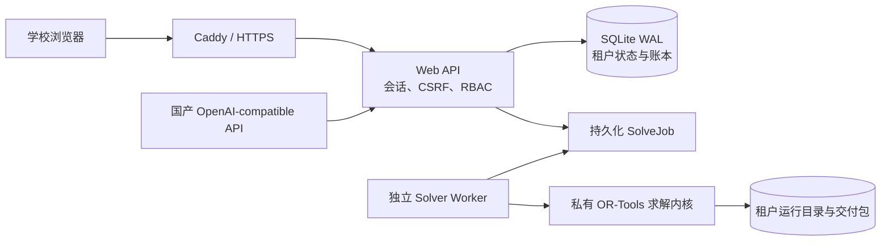

# 单校 SaaS 部署与运维手册

本手册对应 Phase 1 单校 SaaS 发布候选。默认拓扑由 Web、独立求解 Worker、SQLite WAL 数据库和租户输出卷组成；Caddy TLS 反向代理是可选生产入口。浏览器不包含求解器源码，AI 供应商也只能接收受限的数据合同。

## 1. 环境边界

- 适用：单校、单数据库、一个活跃求解 Worker 的首发版本。
- 推荐主机：Linux x86_64、Docker Engine 26+、Docker Compose v2、至少 4 核 CPU / 8 GB 内存。
- 持久数据：Docker 卷 `scheduler_data`，其中包含 SQLite 数据库、租户运行目录、日志证据和结果包。
- 发布种子：镜像只携带 `deploy/seed/blank_school.yaml` 空白模板，不导入本机 `web_overrides.yaml`、教师表、历史求解、结果包或数据库。
- 管理员密钥：Compose 以只读 secret 文件挂载，源码、镜像、环境示例和命令行参数都不保存密码正文。
- 扩容边界：SQLite 版本只允许一个 Worker 实例；需要多学校并发或多个 Worker 时，应先迁移到 PostgreSQL/对象存储，而不是直接增加副本。



## 2. 本机 HTTP 验证

以下命令只把端口绑定到 `127.0.0.1`。`compose.local.yaml` 会关闭 Secure Cookie 和 HSTS，仅供本机验收，不能用于公网。

```powershell
Copy-Item deploy\.env.example deploy\.env
# 编辑 deploy\.env，至少替换学校名称、管理员用户名和登录限流密钥

New-Item -ItemType Directory -Force deploy\secrets | Out-Null
$adminPassword = Read-Host "初始管理员密码" -AsSecureString
$adminPlaintext = [Net.NetworkCredential]::new("", $adminPassword).Password
[IO.File]::WriteAllText(
  (Join-Path (Resolve-Path deploy\secrets) "admin_password"),
  $adminPlaintext,
  [Text.UTF8Encoding]::new($false)
)
Remove-Variable adminPassword, adminPlaintext

docker compose --env-file deploy\.env `
  -f deploy\compose.yaml -f deploy\compose.local.yaml build

docker compose --env-file deploy\.env `
  -f deploy\compose.yaml -f deploy\compose.local.yaml up -d --build web worker
```

`bootstrap` 会从空白模板建立学校工作区，`admin-bootstrap` 会创建管理员。重复部署时，如果管理员声明没有变化则不写库；密码或角色变化时会更新账户并撤销旧会话。`deploy/secrets/` 已被 Git 和 Docker 构建上下文排除。

Linux 上通过 Compose 文件型 secret 挂载时，`admin-bootstrap` 容器以 UID 10001 运行，宿主机密码文件必须允许该 UID 读取。例如在写入后执行 `sudo chown 10001:10001 deploy/secrets/admin_password` 和 `sudo chmod 600 deploy/secrets/admin_password`；不要把密码文件改成全员可读。

打开 `http://127.0.0.1:8765`。首次进入后依次完成：登录、基础数据导入、规则确认、任务创建、任务中心观察、结果诊断和交付包下载。

对外演示优先创建限时只读账号，不要复用管理员账号。以下示例创建 72 小时后自动失效的账号；到期检查由服务端在登录和每次会话解析时执行，尚未结束的旧会话也会立即失效：

```powershell
python -m scheduler.platform.cli --database outputs/platform/scheduler.db create-user `
  --slug current-school `
  --username trial01 `
  --display-name "试用账号 01" `
  --role viewer `
  --password-file deploy/secrets/trial01_password `
  --expires-in-hours 72
```

`viewer` 只能读取脱敏演示数据，不能修改基础数据或规则、启动求解、发布课表、调用 AI 或进入高级对话排课。密码文件应位于 Git 与镜像构建上下文之外，并在账号创建后安全删除。

验证服务状态：

```powershell
Invoke-RestMethod http://127.0.0.1:8765/api/health/live
Invoke-RestMethod http://127.0.0.1:8765/api/health/ready
docker compose --env-file deploy\.env -f deploy\compose.yaml -f deploy\compose.local.yaml ps
docker compose --env-file deploy\.env -f deploy\compose.yaml -f deploy\compose.local.yaml logs --tail 100 web worker
```

## 3. 生产 HTTPS

1. 将域名 A/AAAA 记录解析到服务器。
2. 在 `deploy/.env` 设置真实 `SCHEDULER_DOMAIN`、`CADDY_EMAIL`、管理员用户名和随机限流密钥；在 `deploy/secrets/admin_password` 写入管理员密码并按上述容器 UID 设置读取权限。
3. 保持 `SCHEDULER_COOKIE_SECURE=true`、`SCHEDULER_ALLOW_INSECURE_HTTP=false`、`SCHEDULER_ENABLE_HSTS=true`。
4. 只信任受控反向代理；若不用 Caddy，将 `SCHEDULER_TRUST_PROXY_HEADERS` 设为 `false`。
5. 云防火墙只开放 80/443；应用端口继续绑定 `127.0.0.1`。

```powershell
docker compose --env-file deploy\.env -f deploy\compose.yaml --profile tls up -d
```

不要把 `compose.local.yaml` 带入公网部署。正式上线前应由运维人员验证证书、DNS、主机补丁、磁盘告警、日志保留和异地备份。

上线前额外执行脱敏门禁：

```powershell
python verification\fixes\deployment_privacy_audit.py
```

门禁会检查待发布源码中是否混入 Excel/CSV/数据库/结果目录、Windows 用户路径、手机号、身份证号、非示例邮箱或部署密码，并验证镜像实际导入的是空白种子。

## 4. 国产模型接入

产品支持 OpenAI Chat Completions 与 Responses 两种 JSON 接口，不把 Codex 作为运行时前提。管理员在 AI 服务页保存以下非敏感信息：

- `provider_id`、HTTPS `base_url`、模型名、`wire_api` 和优先级；
- 密钥环境变量名，例如 `DOMESTIC_AI_API_KEY`；
- Responses 模型可配置推理强度；服务端默认发送 `store: false`，不允许供应商留存响应；
- 模型调用前会把已知教师姓名替换为单次请求使用的临时代号，只发送当前规则中实际提到的对象，不发送整份教师定位表；模型结果在服务器本地还原后再进入安全校验；
- 输入/输出单价、超时、熔断阈值和冷却时间；
- 学校或用户的月请求、Token、成本上限。

真实密钥只放在服务器密钥管理系统或 `deploy/.env`，不能写入工作区、数据库、浏览器或 Git。当前路由器支持多供应商优先级、失败回退、短路熔断、用量事件和成本账本。按量收费前，应先用真实供应商账单做至少一个结算周期的对账，不能直接把估算 Token 当作财务凭证。

生产容器默认只允许模型域名解析到公网地址，并拒绝 HTTP 重定向。若使用校内私有模型，必须把精确主机名加入 `SCHEDULER_AI_ALLOWED_HOSTS`；不要关闭网络检查后允许任意管理员地址。

管理员保存设置后应使用“测试真实连接”。该操作会发送一个小型 JSON 请求并进入用量账本；只有返回“连接正常”才能把服务状态视为可用。模型列表可读取不代表推理链路可用，401/403、429 与上游 5xx 会分别显示为密钥、额度和供应商可用性问题。

## 5. 数据库备份

数据库支持在线一致性备份；命令会拒绝覆盖现有文件，并在恢复前校验完整性和迁移版本。

```powershell
$stamp = Get-Date -Format yyyyMMdd-HHmmss
$file = "scheduler-$stamp.db"
docker compose --env-file deploy\.env -f deploy\compose.yaml exec -T web `
  scheduler-platform --database /app/outputs/platform/scheduler.db backup `
  --output "/app/outputs/backups/$file"

New-Item -ItemType Directory -Force backups | Out-Null
docker compose --env-file deploy\.env -f deploy\compose.yaml cp `
  "web:/app/outputs/backups/$file" "backups/$file"
```

结果包和运行证据不在数据库内。完整备份还需在没有运行中任务时复制 `/app/outputs/tenants`，并把数据库备份、租户文件、应用版本和校验和作为同一备份集异地保存。

建议频率：数据库每小时、完整输出每日、发布升级前额外一次；保留 7 个日备份和 4 个周备份，并定期在隔离主机演练恢复。

## 6. 恢复演练

恢复会先生成一份恢复前保护副本。必须先停止 Web 和 Worker，避免旧进程继续写入。

```powershell
docker compose --env-file deploy\.env -f deploy\compose.yaml stop web worker
docker compose --env-file deploy\.env -f deploy\compose.yaml cp `
  "backups\scheduler-YYYYMMDD-HHMMSS.db" `
  "web:/app/outputs/backups/restore-source.db"

docker compose --env-file deploy\.env -f deploy\compose.yaml run --rm --no-deps bootstrap `
  scheduler-platform --database /app/outputs/platform/scheduler.db restore `
  --backup /app/outputs/backups/restore-source.db `
  --confirm-target /app/outputs/platform/scheduler.db `
  --recovery-directory /app/outputs/backups/pre-restore

docker compose --env-file deploy\.env -f deploy\compose.yaml up -d web worker
```

恢复后必须检查 `/api/health/ready`、用户登录、工作区 revision、任务列表和一个历史结果包。生产数据恢复应先在隔离副本演练，再执行变更窗口。

## 7. 升级与回滚

1. 记录当前镜像 digest 和数据库备份。
2. 在隔离环境运行 `verify_release.ps1` 与容器烟雾测试。
3. 构建带不可变版本标签的镜像；不要覆盖已发布标签。
4. 先运行 `bootstrap` 应用向前迁移，再启动 Web/Worker。
5. 检查健康、登录、队列、AI 用量页和下载。
6. 若应用异常，回滚镜像；若迁移导致数据不兼容，停止服务并使用已验证备份恢复。

## 8. 告警与故障处置

- Web readiness 非 200：检查数据库完整性、组织状态和工作区是否存在。
- Worker `unavailable`：检查容器、心跳和租约；120 秒后过期租约会在 Worker 启动时标记失败。
- 连续登录失败：保留限流，检查来源 IP，不要通过删除数据库解除封禁。
- AI 全部不可用：查看供应商熔断和服务端日志；核心排课仍可在不启用 AI 的情况下使用结构化规则。
- 磁盘空间低：停止新求解，转移历史结果；不要在任务运行中直接删除当前运行目录。
- 疑似泄露：轮换模型密钥、会话环境和镜像凭据，保留审计证据，并按组织流程通知负责人。
