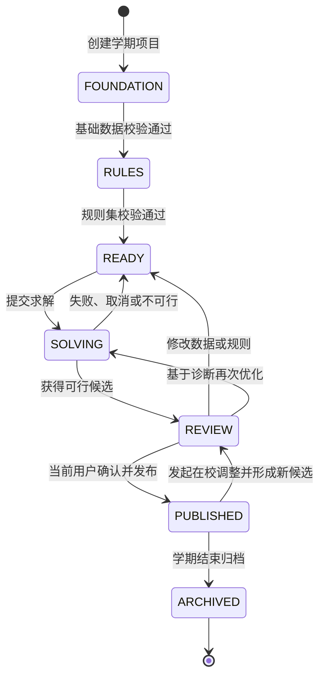
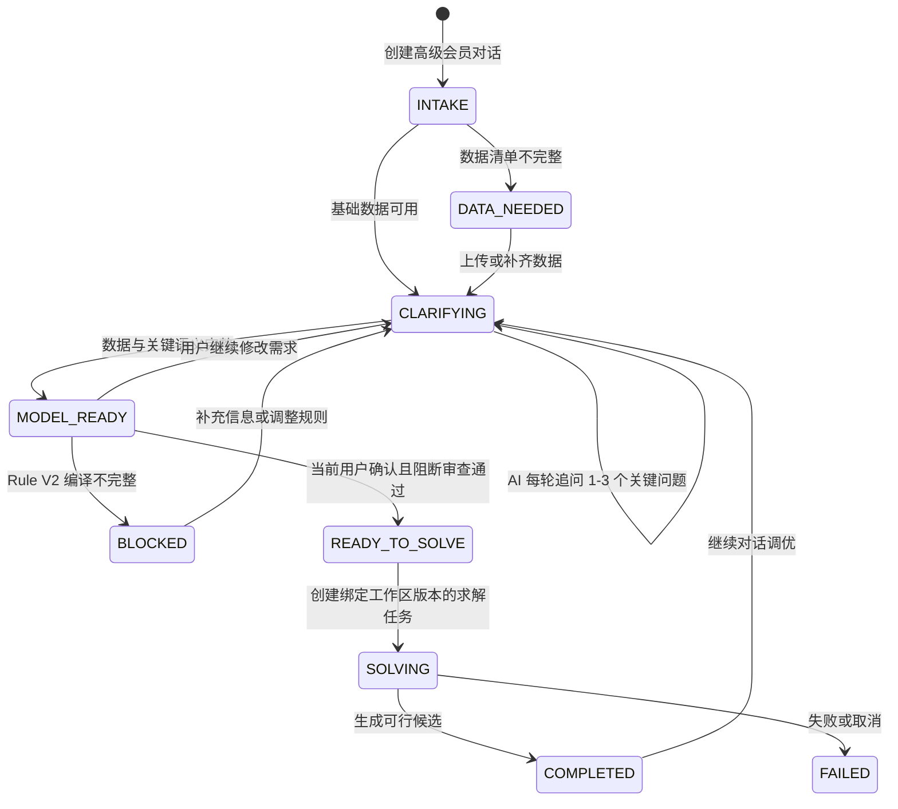

# 正式版项目状态机

状态：设计与实现共同遵守的正式契约  
版本：`scheduler.project-state.v2`  
适用对象：单校一个学期或一个排课周期的排课项目

## 1. 设计结论

正式版不使用“当前在第几页”代替业务状态，也不把准备数据、规则、求解、结果压成四个含糊步骤。项目采用：

- 5 个用户可理解的业务阶段：基础设置、AI 规则建模、AI 智能排课、方案审查与优化、课表发布。
- 4 组可以独立变化的子状态：准备度、规则集、求解任务、候选方案。
- 1 个不可变的工作区版本号。每次数据或规则变更都产生新版本；求解任务必须绑定具体版本。
- 1 条明确的迭代回路：方案诊断 → 修改规则或人工微调 → 重新校验 → 再求解 → 比较版本。

顶层阶段只用于导航和沟通，由子状态推导，不允许前端直接写入。这样可以避免一个巨大枚举同时表达“数据未完成、任务排队、方案已过期、已发布”等互相正交的情况。

## 2. 顶层阶段



| 阶段 | 教务人员看到的名称 | 进入条件 | 主操作 |
| --- | --- | --- | --- |
| `foundation` | 基础设置 | 新建项目或基础数据被修改 | 完成作息、教师、课时和资源设置 |
| `rules` | AI 规则建模 | 基础设置对当前版本校验通过 | 理解、编辑并确认默认、统一、学科和特殊规则 |
| `ready` | 可以进行 AI 排课 | 基础与规则都对当前版本校验通过 | 启动工业级约束求解 |
| `solving` | AI 智能排课中 | 存在当前项目的活动求解任务 | 查看真实阶段、取消任务、继续其他工作 |
| `review` | 审查方案 | 存在当前版本的可行候选方案 | 诊断、比较、微调、锁定或再次优化 |
| `published` | 已发布 | 当前候选已由当前用户确认且发布检查通过 | 下载、分发或发起在校调整 |
| `archived` | 已归档 | 项目被明确归档 | 只读查看和导出 |

## 3. 状态对象

服务端状态事实源使用以下结构；界面只消费派生结果和允许的操作。

```json
{
  "schema_version": "scheduler.project-state.v2",
  "project_id": "project_2026_fall",
  "organization_id": "school_001",
  "name": "2026-2027 学年第一学期排课",
  "lifecycle": "active",
  "phase": "rules",
  "workspace_revision": 18,
  "validated_revision": 18,
  "readiness": {
    "calendar": "ready",
    "teacher_positioning": "ready",
    "curriculum_hours": "ready",
    "resources_and_fixed_events": "warning",
    "ruleset": "dirty",
    "overall": "blocked"
  },
  "ruleset": {
    "revision": 7,
    "status": "draft",
    "active_rule_count": 86,
    "blocking_issue_count": 2
  },
  "solve": {
    "status": "idle",
    "phase": null,
    "active_job_id": null,
    "bound_workspace_revision": null,
    "bound_ruleset_revision": null
  },
  "candidate": {
    "status": "none",
    "candidate_id": null,
    "version": 0,
    "freshness": "none",
    "approved_at": null,
    "published_at": null
  },
  "next_action": {
    "id": "resolve_rule_conflicts",
    "label": "处理 2 条冲突规则",
    "route": "/rules/overview?filter=blocking"
  },
  "allowed_actions": ["edit_rules", "validate_rules"]
}
```

## 4. 子状态

### 4.1 基础准备度

每个基础设置项使用相同状态集合：

- `missing`：必需数据不存在。
- `dirty`：数据已修改，但尚未针对当前工作区版本校验。
- `validating`：正在校验。
- `warning`：可继续，但存在需要明确知晓的风险。
- `ready`：对当前工作区版本校验通过。
- `blocked`：存在阻断求解的问题。

基础设置固定包含：

1. 学期日历与作息：起止日期、单双周、工作日、周末排课、固定公休、临时停课、节次与课间。
2. 教师定位表：教师、任教学科、年级、班级、兼课、行政或值班身份、可用性。
3. 年级学科课时：每班每周课时、连堂/单节结构、选科或走班活动。
4. 资源与固定事项：教室、专用场地、合班、同步课、固定课、校会和教研活动。

### 4.2 规则集

- `draft`：存在未确认修改或 AI 草案。
- `validating`：正在进行结构、引用、冲突和求解器支持校验。
- `ready`：全部活动规则已确认并能编译，且没有阻断冲突。
- `blocked`：存在无效引用、硬规则冲突或不受支持但被要求激活的规则。
- `superseded`：已被更新规则集替代，仅供历史任务追溯。

### 4.3 求解任务

任务状态与求解阶段分离。任务状态是队列事实；阶段是用户可理解的真实进度。

任务状态：

- `idle`
- `queued`
- `running`
- `cancel_requested`
- `completed`
- `failed`
- `cancelled`

运行阶段：

1. `validating`：冻结并复核本次输入、规则集和版本。
2. `compiling`：把 Rule V2 编译为求解合同和 CP-SAT 模型。
3. `finding_feasible`：寻找第一个满足全部硬约束的方案。
4. `optimizing`：改善软规则、均衡度和业务目标。
5. `packaging`：生成诊断、候选课表、统计和交付证据。

界面不得再用“已运行秒数 / 时间上限”冒充完成百分比。阶段可以显示已用时间、当前最佳值和可行解数量；只有后端确实提供可解释的进度时才显示百分比。

### 4.4 候选方案

- `none`：尚无候选。
- `fresh`：候选绑定的工作区和规则集版本与当前版本一致。
- `stale`：候选生成后数据或规则发生变化；只能比较，不能审批或发布。
- `reviewing`：教务人员正在诊断、比较或人工微调。
- `approved`：当前操作用户已明确确认，记录确认人和时间，且仍为最新版本；系统不依赖第三方审批。
- `published`：通过发布检查并生成可分发版本。

### 4.5 高级会员 AI 对话排课

对话排课是独立的会话状态机，不替代项目状态机。它有两个入口：

1. `direct`：从当前项目、基础数据包或已有课表直接开始。
2. `optimization`：从“方案审查与优化”带入当前候选、规则版本和诊断结果。



守卫条件：AI 必须真实参与建模；如果模型服务不可用、规则不受支持或已有课表不能可靠转换，状态必须进入 `blocked` 并列出现有局限和解决建议。上传课表只有在成功映射为 `[班级, 学科, 星期, 时段, 节次]` 后才可作为 warm-start。用户确认前不得激活规则、写入基础数据或启动求解。

## 5. 关键事件和守卫条件

| 事件 | 前置条件 | 状态变化 | 必须产生的证据 |
| --- | --- | --- | --- |
| `project.created` | 学期、名称合法 | 进入 `foundation` | 项目记录、初始 revision |
| `foundation.changed` | 项目未归档 | `workspace_revision + 1`；相应准备度变 `dirty`；现有候选变 `stale` | 不可变工作区版本、审计事件 |
| `foundation.validated` | 当前 revision 校验完成 | 各准备度更新；全部通过后允许进入规则阶段 | 校验结果及被校验 revision |
| `rule.draft_saved` | Rule V2 结构合法 | 规则集变 `draft`；候选变 `stale` | 规则草案版本、来源 |
| `rule.activated` | 规则已确认、可编译、无阻断冲突 | `ruleset_revision + 1`；工作区生成新 revision | 激活版本、确认人、编译器版本 |
| `ruleset.validated` | 所有活动规则可编译 | 规则集变 `ready`；保存 `validated_revision` | 规则快照 hash、冲突报告 |
| `solve.requested` | 当前 revision 已校验；无活动任务 | 创建绑定 workspace/ruleset revision 的任务 | 幂等键、任务快照 |
| `solve.completed_feasible` | 求解器返回可行或最优 | 生成 `fresh` 候选并进入审查 | 候选版本、诊断、目标值 |
| `solve.completed_infeasible` | 无可行解 | 回到 `ready` 并显示阻断诊断 | 不可行核心或可解释冲突 |
| `candidate.adjusted` | 候选为 `fresh/reviewing` | 生成新候选版本并重新校验，不覆盖原候选 | 调整记录、影响范围 |
| `candidate.approved` | 候选 `fresh` 且发布检查无阻断 | 候选变 `approved` | 当前确认用户、时间、检查报告 |
| `candidate.published` | 候选已由当前用户确认且仍为当前版本 | 项目进入 `published` | 发布版本、交付清单、校验 hash |
| `published.change_requested` | 项目已发布 | 创建变更集或新候选，不修改已发布版本 | 变更原因、影响对象 |

## 6. 并发和版本规则

1. 求解开始时冻结 `workspace_revision`、`ruleset_revision` 和内容 hash。
2. 求解运行期间允许教务继续编辑，但这些修改进入新 revision，不影响正在运行的任务。
3. 旧 revision 的任务完成后，如果当前 revision 已变化，结果直接标记为 `stale`，不得显示为“当前可发布”。
4. 已激活的规则版本不可原地修改；编辑会生成新草案版本。
5. 人工微调不覆盖原始候选，必须形成可比较的新候选版本。
6. 已发布课表不可被普通编辑覆盖；在校调整通过独立变更集和重新发布完成。

## 7. 正式版界面映射

- 公共欢迎页以“AI 理解个性化规则 + 工业级求解引擎”为核心价值，同时只解释用户收益和开始入口，不展示线程、配置路径等实现细节。
- 项目首页是“任务清单 + 当前状态 + 唯一下一步”，状态来自本契约，不由前端猜测。
- 基础设置采用 4 个有完成条件的任务，而不是一个无限长导入页面。
- 规则中心用表格/分组列表承载大量规则；硬软强度、业务层级、启用状态是三个独立视觉维度。
- 求解页展示真实运行阶段；任务可离开页面后台运行。
- 方案审查页统一承载诊断、自然语言调整、版本比较、人工微调和重新优化。
- 任何过期候选都显示持久警告，并禁用审批、发布按钮。

## 8. 必须通过的状态机验收

- 非法迁移由服务端拒绝，不能依赖隐藏按钮保证。
- 数据或规则一经修改，旧候选立即过期。
- 每个求解任务都能追溯到准确的工作区和规则集版本。
- 运行中修改不会污染已经冻结的求解任务。
- 失败、取消、不可行、可行、最优是不同结果，不用一个“完成”状态混淆。
- 用户确认和发布只接受当前、已校验、未过期的候选，不依赖第三方审批。
- 已发布版本可追溯、可下载、可比较，且不能被在校调整直接覆盖。
